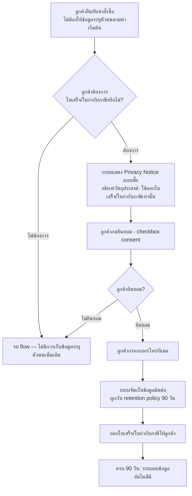

# User Journey - ลูกค้าขอใบเสร็จ/ใบกำกับภาษี (ให้ความยินยอมตาม PDPA)

**วันที่สร้าง/ปรับปรุงล่าสุด:** 2026-08-16
**Actor หลัก:** ลูกค้า
**อ้างอิงจาก:** [[../../01-requirements/01-spec/20260802-002-system-log-pdpa|002 - การเก็บ Log ของระบบ และการปฏิบัติตาม PDPA เบื้องต้น]]

## Diagram

## คำอธิบายตามลำดับขั้นตอน

1. **ยืนยันคำสั่งซื้อโดยไม่ต้องให้ข้อมูลระบุตัวตน** — ตามค่าเริ่มต้น ระบบไม่เก็บข้อมูลระบุตัวตนลูกค้า (เบอร์โทร/อีเมล) สำหรับการสั่งซื้อทั่วไป
2. **ลูกค้าเลือกว่าต้องการใบเสร็จ/ใบกำกับภาษีหรือไม่** — ถ้าไม่ต้องการ flow จบทันทีโดยไม่มีการเก็บข้อมูลเพิ่ม
3. **แสดง Privacy Notice แบบสั้น** — เมื่อลูกค้าต้องการใบเสร็จ/ใบกำกับภาษี ระบบต้องแสดงข้อความสั้นๆ อธิบายวัตถุประสงค์การใช้ข้อมูล (ออกใบเสร็จ/ใบกำกับภาษีเท่านั้น) ก่อนขอข้อมูลใดๆ
4. **ขอความยินยอม (consent)** — ลูกค้าต้องกดยินยอมแบบง่าย (เช่น checkbox) ก่อนระบบจะเก็บข้อมูล ถ้าไม่ยินยอม flow จบโดยไม่เก็บข้อมูล
5. **กรอกเบอร์โทร/อีเมล** — ลูกค้ากรอกข้อมูลติดต่อที่จำเป็นสำหรับออกใบเสร็จ/ใบกำกับภาษีเท่านั้น
6. **จัดเก็บข้อมูลภายใต้ retention policy** — ข้อมูลติดต่อที่เก็บไว้อยู่ภายใต้ retention policy เดียวกับ log อื่นของระบบ (เก็บสูงสุด 90 วัน)
7. **ออกใบเสร็จ/ใบกำกับภาษี** — ระบบออกใบเสร็จ/ใบกำกับภาษีให้ลูกค้าตามที่ร้องขอ
8. **ลบข้อมูลอัตโนมัติเมื่อครบกำหนด** — เมื่อครบ 90 วัน ระบบลบ/ทำลายข้อมูลติดต่อลูกค้าทิ้งอัตโนมัติตามหลัก data minimization

## Mapping กลับไปยัง Requirement

| ขั้นตอนใน Diagram | Requirement ที่เกี่ยวข้อง |
|---|---|
| ยืนยันคำสั่งซื้อโดยไม่ต้องให้ข้อมูลระบุตัวตน (ค่าเริ่มต้น) | [[../../01-requirements/02-plan/feature-list#F-011 - ขอ consent + privacy notice แบบสั้น เมื่อลูกค้าขอใบเสร็จ/ใบกำกับภาษี\|F-011]] |
| แสดง Privacy Notice / ขอ consent / กรอกข้อมูล / ออกใบเสร็จ | [[../../01-requirements/02-plan/feature-list#F-011 - ขอ consent + privacy notice แบบสั้น เมื่อลูกค้าขอใบเสร็จ/ใบกำกับภาษี\|F-011]] |
| จัดเก็บข้อมูลภายใต้ retention policy / ลบอัตโนมัติเมื่อครบ 90 วัน | [[../../01-requirements/02-plan/feature-list#F-009 - Retention policy: เก็บ log 90 วันแล้วลบอัตโนมัติ\|F-009]] |

**หมายเหตุ:** ข้อกำหนด "ห้ามบันทึกข้อมูลอ่อนไหวแบบ plain text" ([[../../01-requirements/02-plan/feature-list#F-010 - ป้องกันข้อมูลอ่อนไหว (บัตร/รหัสผ่าน/OTP) ไม่ให้ถูกบันทึกลง log แบบ plain text\|F-010]]) และการจำกัดสิทธิ์เข้าถึง log ([[../../01-requirements/02-plan/feature-list#F-008 - จำกัดสิทธิ์การเข้าถึง log เฉพาะเจ้าของร้าน/แอดมิน\|F-008]]) เป็นมาตรการเบื้องหลังที่คุ้มครองข้อมูลใน journey นี้เช่นกัน แต่ไม่ปรากฏเป็นขั้นตอนที่ลูกค้าเห็น/โต้ตอบโดยตรง จึงไม่ได้วาดเป็น node แยกใน diagram

## เอกสารที่เกี่ยวข้อง

- [[../../01-requirements/01-spec/index|01-spec]]
- [[../../01-requirements/02-plan/feature-list|Feature List]]
- [[table-ordering-qr-journey|User Journey - ลูกค้าสั่งกาแฟที่โต๊ะผ่าน QR Code]]
