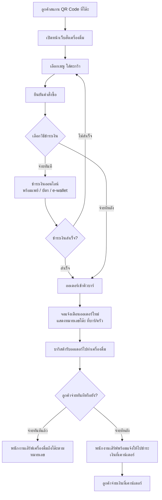

# User Journey - ลูกค้าสั่งกาแฟที่โต๊ะผ่าน QR Code

**วันที่สร้าง/ปรับปรุงล่าสุด:** 2026-08-16
**Actor หลัก:** ลูกค้า, บาริสต้า
**อ้างอิงจาก:** [[../../01-requirements/01-spec/20260802-001-table-ordering-qr|001 - ระบบสั่งกาแฟที่โต๊ะผ่าน QR Code]]

## Diagram

## คำอธิบายตามลำดับขั้นตอน

1. **สแกน QR Code** — ลูกค้าสแกน QR Code ที่ติดอยู่บนโต๊ะของตัวเอง เปิดหน้าเว็บสั่งเครื่องดื่มได้ทันทีโดยไม่ต้องติดตั้งแอพ
2. **เลือกเมนู/ใส่ตะกร้า/ยืนยันคำสั่งซื้อ** — ลูกค้าเลือกเมนู เพิ่มลงตะกร้า และยืนยันคำสั่งซื้อจากหน้าเว็บ
3. **เลือกวิธีชำระเงิน** — ลูกค้าเลือกได้เองว่าจะ "จ่ายทันที" ผ่านช่องทางออนไลน์ หรือ "จ่ายทีหลัง" ที่เคาน์เตอร์
4. **จ่ายทันที (ถ้าเลือก)** — ลูกค้าชำระเงินผ่านพร้อมเพย์/บัตร/e-wallet หากชำระไม่สำเร็จ ต้องกลับไปแก้ไข/ยืนยันคำสั่งซื้อใหม่ ออเดอร์จะยังไม่เข้าคิวบาร์จนกว่าจะจ่ายสำเร็จ
5. **ออเดอร์เข้าคิวบาร์** — ออเดอร์ที่ "จ่ายทันที" เข้าคิวเมื่อชำระเงินสำเร็จเท่านั้น ส่วนออเดอร์ที่ "จ่ายทีหลัง" เข้าคิวทันทีที่ยืนยันคำสั่งซื้อ โดยไม่ต้องรอชำระเงิน
6. **แจ้งเตือนบาร์/ครัวแบบเรียลไทม์** — จอแสดงรายการออเดอร์ใหม่ที่บาร์/ครัวแสดงออเดอร์พร้อมหมายเลข/ตำแหน่งโต๊ะกำกับไว้
7. **บาริสต้ารับออเดอร์ไปทำ** — บาริสต้าเห็นออเดอร์ใหม่และลงมือทำเครื่องดื่ม
8. **เสิร์ฟถึงโต๊ะ / แจ้งชำระเงิน** — พนักงานเสิร์ฟเครื่องดื่มถึงโต๊ะตามหมายเลขที่กำกับไว้ ถ้าเป็นออเดอร์แบบจ่ายทีหลัง จะแจ้งให้ลูกค้าไปชำระเงินที่เคาน์เตอร์

## Mapping กลับไปยัง Requirement

| ขั้นตอนใน Diagram | Requirement ที่เกี่ยวข้อง |
|---|---|
| สแกน QR Code / เปิดหน้าเว็บ / เลือกเมนู / ยืนยันคำสั่งซื้อ | [[../../01-requirements/02-plan/feature-list#F-001 - สั่งเมนูผ่านหน้าเว็บด้วยการสแกน QR Code ที่โต๊ะ\|F-001]] |
| ชำระเงินออนไลน์ทันที | [[../../01-requirements/02-plan/feature-list#F-002 - ชำระเงินออนไลน์ทันทีก่อนออเดอร์เข้าครัว\|F-002]] |
| จ่ายทีหลังที่เคาน์เตอร์ | [[../../01-requirements/02-plan/feature-list#F-003 - สั่งก่อน จ่ายเงินที่เคาน์เตอร์ภายหลัง\|F-003]] |
| จอแจ้งเตือนออเดอร์ใหม่ที่บาร์/ครัว | [[../../01-requirements/02-plan/feature-list#F-004 - แจ้งเตือนออเดอร์ใหม่แบบเรียลไทม์ให้บาร์/ครัว\|F-004]] |
| หมายเลขโต๊ะกำกับในออเดอร์ / เสิร์ฟถูกโต๊ะ | [[../../01-requirements/02-plan/feature-list#F-005 - ระบุหมายเลข/ตำแหน่งโต๊ะกำกับในแต่ละออเดอร์\|F-005]] |

## เอกสารที่เกี่ยวข้อง

- [[../../01-requirements/01-spec/index|01-spec]]
- [[../../01-requirements/02-plan/feature-list|Feature List]]
- [[receipt-tax-invoice-consent-journey|User Journey - ลูกค้าขอใบเสร็จ/ใบกำกับภาษี]]
